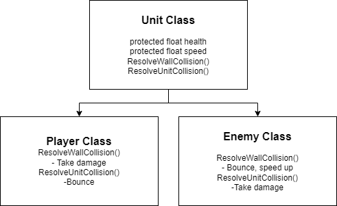

# Final project for the unity junior programmer course

### Play the game here:
-https://play.unity.com/mg/other/build-9nj

### Objective:
- Small project in the span of a few hours
- Incorporate the 4 principals of object oriented programming
    - Abstraction
    - Inheritance
    - Polymorphism
    - Encapsulation

### Concept:
- Arena game where primitive objects move and bounce around an enclosed space
- If player hits wall, player takes damage.  
- If enemy hits wall, it bounces and gains momentum
- if player hits enemy, enemy takes damage

### Aproach:
- Abstraction & Encapsulation:
  - Code will be written with these principals in mind
- Inheritance & Polymorphism:
  - Player and Enemy objects will inherite from a common parent class, and have different behaviour.

